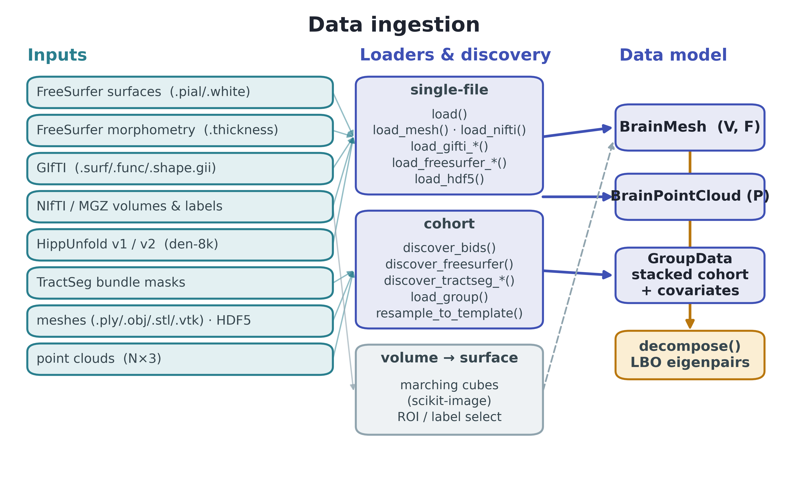
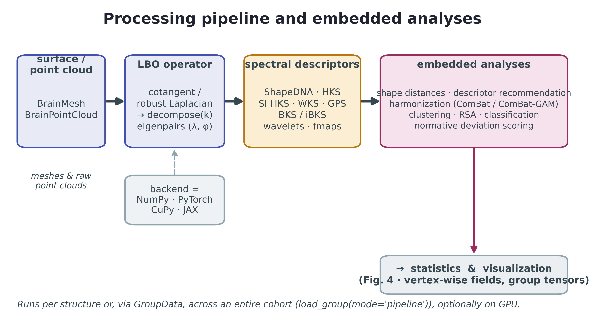
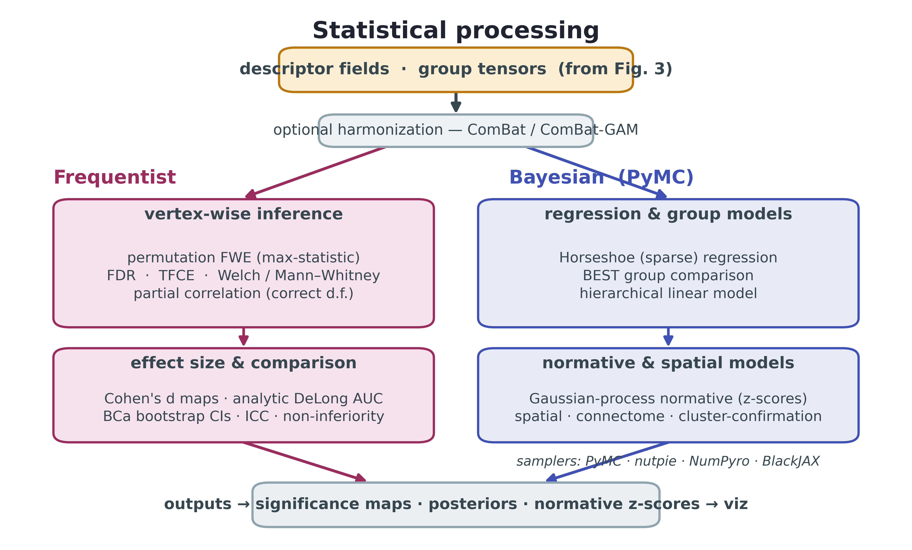

# Summary

`SpectralBrain` is a Python library for spectral shape analysis of brain
structures. From the eigenvalues and eigenfunctions of the Laplace-Beltrami
operator (LBO) on a surface mesh or point cloud, it computes a family of
intrinsic shape descriptors, including ShapeDNA [@reuter2006shapedna; @reuter2009eigenfunctions], the Heat
Kernel Signature [@sun2009hks] and its scale-invariant variant
[@bronstein2010sihks], the Wave Kernel Signature [@aubry2011wks], the Global
Point Signature [@rustamov2007gps], point-cloud spectral signatures
[@bates2011spectral], spectral graph wavelets, and functional maps
[@ovsjanikov2012fmaps]. These descriptors are invariant to rigid pose and to
mesh parameterization, so they characterize geometry that volume and thickness
summaries miss. Around the descriptors, the library provides the rest of a
study: reading the common neuroimaging formats, loading and harmonizing
cohorts, vertex-wise and Bayesian statistics, and publication-quality rendering
(\autoref{fig:arch}). Its first application is the hippocampus in mesial
temporal lobe epilepsy with hippocampal sclerosis (MTLE-HS), though the methods
apply to any brain surface or segmented structure.

{ width=92% }

# Statement of need

Intrinsic spectral descriptors are well understood in geometry processing, where
they have been studied since the introduction of ShapeDNA [@reuter2006shapedna]
and the kernel signatures that followed [@sun2009hks; @aubry2011wks]. They reach
clinical neuroimaging only rarely, and when they do, each study tends to
reimplement the pipeline from scratch. Work on the hippocampus in temporal lobe
epilepsy [@bates2011spectral] and on whole-brain morphology
[@wachinger2015brainprint] shows that shape descriptors add information beyond
volumetry, yet no released, tested package takes a researcher from standard
inputs through descriptors, correct group statistics, and figures.

Two research communities are involved, and they seldom share tools. Geometry
processing produces the descriptors and the libraries that compute them on
meshes, but those libraries know nothing about FreeSurfer, BIDS, or
multi-site batch effects. Clinical neuroimaging has mature conventions for
surface morphometry, harmonization, and normative modelling, but works almost
entirely in volumes and thicknesses rather than intrinsic spectra.
`SpectralBrain` is built as a bridge between the two. It speaks the file formats
and cohort conventions of neuroimaging while exposing the descriptor family and
the discrete operators (the cotangent Laplacian [@meyer2003discrete] and the
robust intrinsic Laplacian for poor meshes and point clouds
[@sharp2020laplacian]) of geometry processing.

The intended users are clinical and methodological researchers who want spectral
shape features without writing the surrounding infrastructure: epilepsy and
neurodegeneration groups studying subfield-level change, and shape-analysis
methodologists who need validated neuroimaging input and inference. The library
is designed so that the choice to use it, rather than assemble several
single-purpose tools by hand, is the path of least resistance for such a study.

# State of the field

Existing tools sit on one side of the bridge or the other. `LaPy` and
`BrainPrint` [@wachinger2015brainprint] compute LBO eigenvalues from FreeSurfer
output, but stop at the spectrum: they offer no vertex-wise descriptors, group
statistics, harmonization, or Bayesian modelling. General geometry-processing
libraries expose Laplacians and a few signatures on meshes, with no neuroimaging
orientation. `HippUnfold` [@dekraker2022hippunfold] and `HippoMaps`
[@dekraker2025hippomaps] produce and contextualize hippocampal surfaces, and
`BrainSpace` [@vosdewael2020brainspace] computes connectivity gradients, but none
targets intrinsic spectral shape. Statistical-shape-modelling packages describe
shape through point correspondences or diffeomorphic deformations rather than
spectra. `PCNtoolkit` [@rutherford2022normative] and the ComBat family
[@johnson2007combat; @pomponio2020harmonization] handle normative modelling and
harmonization of scalar features, problems `SpectralBrain` addresses for spectral
descriptors and wraps where appropriate. The gap `SpectralBrain` fills is the
integration: one library that couples the descriptor family to neuroimaging
input, family-wise-error-controlled statistics, Bayesian and normative models,
harmonization, and rendering.

# Software design and functionality

Data enter through `spectralbrain.io` (\autoref{fig:ingest}), which reads
FreeSurfer surfaces and morphometry [@fischl2012freesurfer], GIfTI and NIfTI or
MGZ files, HippUnfold v1 and v2 outputs [@dekraker2022hippunfold], TractSeg
white-matter bundles [@wasserthal2018tractseg], common mesh formats, HDF5, and
raw point clouds. Volumetric labels become surfaces by marching cubes
[@vandalwalt2014skimage]. Cohorts are discovered from BIDS derivatives
[@gorgolewski2016bids] or a FreeSurfer subjects directory, loaded in parallel,
optionally resampled to a common template, and stacked as a `GroupData` object.
Everything reduces to two objects, `BrainMesh` and `BrainPointCloud`, each with a
`decompose` method that returns LBO eigenpairs.

{ width=92% }

From the eigenpairs the `spectral` subpackage computes the descriptor family and
a set of intrinsic distances between structures (\autoref{fig:pipeline}). The
same call runs on one structure or, through `GroupData`, across a whole cohort,
and the eigensolver backend is selectable among NumPy, PyTorch, CuPy, and JAX,
so large analyses can move to the GPU without code changes. Embedded analyses
include descriptor ranking, harmonization, clustering, representational
similarity, classification, and normative deviation scoring.

{ width=95% }

The `statistics` subpackage (\autoref{fig:stats}) provides two tracks. The
frequentist track offers vertex-wise tests with family-wise error
control by max-statistic permutation [@nichols2002permutation], false-discovery
control, threshold-free cluster enhancement [@smith2009tfce], partial
correlations with correct degrees of freedom, Cohen's d maps, the analytic
DeLong test for comparing areas under the ROC curve [@delong1988auc], and
bias-corrected and accelerated bootstrap intervals. The Bayesian track, built on
PyMC [@abrilpla2023pymc] with diagnostics through ArviZ [@kumar2019arviz],
includes sparse horseshoe regression, a heavy-tailed group comparison (BEST), a hierarchical
linear model, and a Gaussian-process normative model, with a choice of samplers.
Multi-site batch effects can be removed beforehand with ComBat and ComBat-GAM
[@johnson2007combat; @pomponio2020harmonization]. Results render through a
template-free six-view renderer and unfolded flat-maps built on PyVista
[@sullivan2019pyvista] and vedo, alongside posterior and cluster plots. The
library rests on NumPy [@harris2020numpy] and SciPy [@virtanen2020scipy], ships
type hints and tests, and documents a public API for each subpackage.

{ width=92% }

# Research impact

The library was built for the study of MTLE-HS, the most common drug-resistant
focal epilepsy and one graded by subfield-level cell loss into ILAE types with
different surgical prognoses [@blumcke2013ilae]. Because spectral descriptors are
sensitive to localized, pose-invariant geometric change, they suit questions
about subfield shape, hemispheric lateralization, and outcome that volume alone
answers poorly. `SpectralBrain` supports an ongoing program on hippocampal and
thalamic shape in epilepsy cohorts, and the same pipeline transfers to
neurodegeneration and to white-matter tracts without modification.

# AI usage disclosure

Generative AI assistants were used for code scaffolding, refactoring,
documentation drafting, and copy-editing of this manuscript. The authors
designed the methods, verified the statistical implementations against reference
results, reviewed all generated code, and are responsible for the final content.

# Acknowledgements

We thank colleagues at the Instituto Nacional de Neurociência Translacional and
the Universidade Federal de Santa Catarina for discussion and testing. [Funding
sources and grant numbers to be added.]

# References
